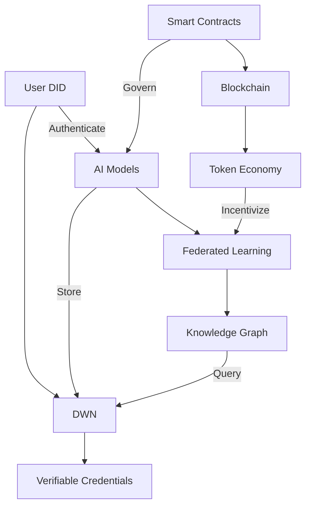

# AIPlatform 🚀

> **The Most Advanced Next-Generation Decentralized AI Platform** — built on Web3, Web4, and Web5 technologies with quantum computing, metaverse integration, and edge computing capabilities for the future of intelligent systems.

[](https://opensource.org/licenses/MIT)
[](https://developer.tbd.website/)
[](https://ethereum.org/en/web3/)
[](https://aiplatform.org/quantum)
[](https://aiplatform.org/platforms)
[](https://aiplatform.org/ai)

## 🌐 Overview

AIPlatform is a **modular, decentralized AI ecosystem** built on Web3, Web4, and Web5 technologies. It combines **AI frameworks, blockchain-powered governance, data marketplaces, and privacy-preserving computation** into one unified platform.

### Core Technologies

| Layer | Technology | Advanced Features |
|-------|------------|-------------------|
| **Web5** | Quantum DIDs, Encrypted DWN | Quantum-resistant identity, privacy-first data |
| **Web4** | Federated Quantum AI | Distributed quantum ML, metaverse AI |
| **Web3** | Advanced Cross-Chain | Multi-blockchain bridges, quantum security |
| **Edge** | Distributed Computing | IoT integration, edge AI, mesh networking |
| **Meta** | VR/AR Platform | Spatial computing, metaverse integration |

## ✨ **Quantum-Enhanced Features**

### 🧠 **Advanced AI Systems**
- **Federated Quantum Learning**: Train models across quantum and classical nodes
- **Neural Architecture Search**: Automatic quantum neural network design
- **Collaborative AI**: Real-time multi-user AI sessions
- **Model Marketplace**: Trade and license AI models with smart contracts

### ⚛️ **Quantum Computing**
- **Shor's Algorithm**: Quantum factorization for advanced cryptography
- **Grover's Search**: Quantum database search and optimization
- **Quantum Machine Learning**: Quantum neural networks and algorithms
- **Quantum Key Distribution**: Unbreakable quantum encryption

### 🌐 **Metaverse Integration**
- **Virtual Worlds**: Create and manage immersive environments
- **Spatial AI**: 3D-aware artificial intelligence
- **Cross-Metaverse Trading**: NFT transfers between virtual worlds
- **VR/AR Development**: Full WebXR and native VR support

### 🔗 **Advanced Blockchain**
- **Cross-Chain DEX**: Atomic swaps across 6+ blockchains
- **Quantum Bridges**: Secure quantum-resistant blockchain connections
- **Multi-Chain DeFi**: Advanced decentralized finance protocols
- **Blockchain Oracles**: Quantum-secure price feeds

## 🚀 Quick Start

### Prerequisites

- Node.js 20.x
- Python 3.8+
- Git
- Docker (optional)
- Web5 Wallet (e.g., TBDex, Web5.js)
- MetaMask or other Web3 wallet

### Installation

1. **Clone the repository**
   ```bash
   git clone https://github.com/REChain-Network-Solutions/AIPlatform.git
   cd AIPlatform
   ```

2. **Install dependencies**
   ```bash
   # Install JavaScript dependencies
   npm install
   
   # Install Python dependencies
   pip install -r requirements.txt
   ```

3. **Set up environment**
   ```bash
   cp .env.example .env
   # Edit .env with your configuration
   ```

4. **Start development servers**
   ```bash
   # Start local blockchain
   npx hardhat node
   
   # In a new terminal, deploy contracts
   npx hardhat run scripts/deploy.js --network localhost
   
   # Start frontend development server
   npm run dev
   ```

5. **Access the application**
   Open your browser and navigate to `http://localhost:3000`

## 📚 Documentation

Comprehensive documentation is available in the [docs](./docs) directory:

- [Architecture Overview](./docs/architecture/overview.md)
- [Web3 Integration](./docs/architecture/web3/README.md)
- [Web4 AI/ML Layer](./docs/architecture/web4/README.md)
- [Web5 Identity & Data](./docs/architecture/web5/README.md)
- [Integration Guide](./docs/integration/README.md)
- [Getting Started Guide](./docs/guides/getting-started.md)

## 🏗️ Architecture



### Data Flow
1. **Identity & Auth**: Users authenticate with Web5 DIDs
2. **Data Storage**: Encrypted data stored in DWN
3. **AI Processing**: Federated learning on user data
4. **Governance**: On-chain voting for model updates
5. **Monetization**: Token rewards for data contributions

## 📂 Project Structure

```
AIPlatform/
├── 🎯 platforms/              # 15+ Advanced platform implementations
│   ├── 🖥️  desktop/          # Electron apps (Win/Mac/Linux)
│   ├── 📱 mobile/            # iOS, Android, React Native, WinUWP
│   ├── 🎮 vr-ar/             # VR/AR and WebXR platforms
│   ├── 🔌 iot/               # IoT and smart device integration
│   ├── 🔧 embedded/          # ESP32, Arduino, Raspberry Pi
│   ├── 🌐 web/               # PWA with Web3/4/5 support
│   ├── 📺 tvos/              # Apple TV platform
│   ├── 📱 aurora/            # Aurora OS platform
│   ├── ⚙️  tizen/             # Samsung Tizen platform
│   ├── 📱 harmonyos/         # Huawei HarmonyOS platform
│   └── 🎨 flutter/           # Flutter cross-platform
├── 🌉 bridges/               # Advanced cross-chain & AI bridges
│   ├── ⚛️  blockchain/       # Multi-blockchain with quantum security
│   ├── 🧠 ai-bridges/        # Federated quantum AI systems
│   └── 🔗 api-bridges/       # Code + Vibe transfer & custom APIs
├── 🔬 verticals/             # Domain-specific quantum solutions
│   ├── 🧮 quantum/           # Quantum computing & algorithms
│   ├── 🌐 metaverse/         # Virtual worlds & spatial computing
│   ├── 🔌 edge/              # Edge computing & IoT
│   ├── 💼 governance/        # Advanced DAO systems
│   └── 📊 marketplace/       # Decentralized data & model markets
├── 🔄 horizontals/           # Quantum-enhanced shared services
│   ├── 🔐 quantum-encryption/ # Post-quantum cryptography
│   ├── 💻 distributed/       # Distributed quantum computing
│   ├── 📝 logging/           # Quantum-secure logging
│   └── 🏥 monitoring/        # Advanced system monitoring
├── 🌍 international/         # Global Git systems & compliance
│   ├── 🇨🇦 canada/           # Canadian systems (PIPEDA)
│   ├── 🇮🇱 israel/           # Israeli systems (defense integration)
│   ├── 🌏 arab/              # Arab countries systems
│   ├── 🇦🇺 australia/        # Australian systems
│   ├── 🇨🇳 china/            # Chinese systems (Gitee)
│   └── 🌍 other/             # Additional international systems
├── 🐳 infrastructure/        # Advanced deployment & orchestration
│   ├── 🚀 docker/            # Multi-arch containers & edge deployment
│   ├── ☸️  k8s/               # Quantum-resistant Kubernetes
│   └── 📋 compose/           # Advanced service orchestration
├── 🧪 quantum/               # Quantum computing implementations
│   ├── 🔬 algorithms/        # Shor's, Grover's, QAOA
│   ├── 🔐 crypto/            # Post-quantum cryptography
│   └── 🧠 ai/                # Quantum machine learning
└── 📚 docs/                  # Comprehensive quantum documentation
    ├── 🚀 getting-started/   # Advanced setup guides
    ├── 🔬 quantum/           # Quantum computing guides
    ├── 🌐 metaverse/         # VR/AR documentation
    └── 🔌 edge/              # IoT and embedded guides
```
## 🚀 Multi-Platform Development

AIPlatform supports development across multiple platforms:

### Supported Platforms
- **Web**: Browser-based application with PWA support.
- **iOS**: Native mobile app using Capacitor.
- **macOS**: Desktop app using Electron.
- **Windows**: Desktop app for Windows.
- **Linux**: Desktop app with AppImage support.
- **WinUWP**: Universal Windows Platform.
- **Aurora**: Custom platform integrations.
- **Android**: Mobile Android application using React Native.
- **Tizen**: Tizen OS for Samsung devices and IoT.
- **HarmonyOS**: Huawei's HarmonyOS for distributed apps.
- **Flutter**: Cross-platform application for mobile, web, and desktop.
- **tvOS**: Apple TV application.
- **VR/AR**: Oculus Quest, Vision Pro, WebXR support.
- **IoT**: Smart devices, sensors, and edge computing.
- **Embedded**: ESP32, Arduino, Raspberry Pi integration.

### Building for Platforms

```bash
# Desktop
npm run build:macos
npm run build:windows
npm run build:linux

# Mobile
npm run build:ios
npm run build:android
npm run build:winuwp

# Specialized
npm run build:vr-ar
npm run build:iot
npm run build:embedded
npm run build:aurora
npm run build:tizen
npm run build:harmonyos
npm run build:flutter
npm run build:tvos
```

### Advanced CI/CD

Multi-platform builds with quantum-enhanced security testing and global Git system integration.

## 🌐 Integrations

### Blockchain (6+ Networks)
- Polkadot for cross-chain interoperability
- Ethereum for smart contracts and DeFi
- Solana for high-performance DApps
- BSC (Binance Smart Chain) for DeFi and tokens
- Cardano for advanced smart contracts
- Avalanche for high-throughput transactions

### Advanced AI Systems
- **OpenAI GPT**: Chat and text generation
- **Claude**: Advanced reasoning and analysis
- **Llama**: Open-source AI model integration
- **GenAI**: Media generation capabilities
- **MCP**: Model context sharing protocol
- **Quantum AI**: QML and quantum neural networks
- **Federated Learning**: Distributed model training

### Global Git Systems (15+)
- **Domestic**: GitHub, GitLab, GitFlic, GitVerse, SourceCraft
- **International**: Canada, Israel, Arab countries, Australia, China, EU
- **Enterprise**: Azure DevOps, Bitbucket, GitKraken
- **Security**: Enhanced encryption and compliance features

### VR/AR & Spatial Computing
- **WebXR**: Browser-based VR/AR
- **Oculus SDK**: Native Quest integration
- **Vision Pro**: Apple AR development
- **Spatial AI**: 3D-aware artificial intelligence
- **Metaverse**: Cross-platform virtual worlds

### IoT & Edge Computing
- **MQTT**: Real-time device communication
- **Edge AI**: TensorFlow Lite, ONNX Runtime
- **Smart Home**: Home Assistant, smart devices
- **Industrial IoT**: SCADA, predictive maintenance
- **Mesh Networking**: Distributed edge nodes

See [Integration Docs](./docs/integration/) for details.

## 🔧 Development

### Running Tests

```bash
# Run smart contract tests
npx hardhat test

# Run AI model tests
pytest ai/tests/

# Run frontend tests
npm test
```

### Building for Production

```bash
# Compile smart contracts
npx hardhat compile

# Deploy contracts
npx hardhat run scripts/deploy.js --network mainnet

# Build frontend
npm run build

# Package AI models
python scripts/package_models.py
```

### Local Development

Start a local development environment with Docker:

```bash
docker-compose up -d
```

This will start:
- Local Laravel app (PHP 8.3)
- MySQL database
- Redis cache
- Ethereum blockchain node
- IPFS storage

Then run:
```bash
php artisan migrate
npm run dev
```

Access at http://localhost:8000.

Explore our comprehensive documentation to get started:

### Core Concepts
- [Web3/4/5 Architecture](./docs/architecture/overview.md)
- [Decentralized Identity](./docs/architecture/web5/README.md)
- [AI/ML Integration](./docs/architecture/web4/README.md)
- [Blockchain Layer](./docs/architecture/web3/README.md)

### Guides
- [Getting Started](./docs/guides/getting-started.md)
- [Building Your First DApp](./docs/guides/building-dapp.md)
- [AI Model Training](./docs/guides/ai-training.md)
- [Smart Contract Development](./docs/guides/smart-contracts.md)

### API Reference
- [Web5 SDK](./docs/api/web5-sdk.md)
- [Smart Contracts](./docs/api/smart-contracts.md)
- [REST API](./docs/api/rest-api.md)

## 🛡 Security

Security is fundamental to our platform. We implement multiple layers of protection:

### Security Features
- End-to-end encryption for all data
- Zero-knowledge proofs for privacy
- Multi-signature wallets for treasury
- Regular security audits

### Reporting Vulnerabilities
Please report security issues to security@rechain.network. We operate a bug bounty program for responsible disclosures.

### Audits
- [CertiK Audit Report](./audits/certik-audit-2023.pdf)
- [OpenZeppelin Audit Report](./audits/openzeppelin-audit-2023.pdf)

## 🤝 Contributing

We welcome contributions from the community! Here's how you can help:

1. **Code Contributions**: Submit pull requests for new features or bug fixes
2. **Documentation**: Help improve our docs or translate them
3. **Testing**: Report bugs or help test new features
4. **Community**: Help others in our [Discord](https://discord.gg/aiplatform)

Please read our [Contributing Guide](CONTRIBUTING.md) for details.

## 🌍 Community

- [Discord](https://discord.gg/aiplatform) - Chat with the community
- [Twitter](https://twitter.com/aiplatform) - Latest updates
- [GitHub Discussions](https://github.com/REChain-Network-Solutions/AIPlatform/discussions) - Q&A
- [Blog](https://blog.aiplatform.org) - Tutorials and articles

## 📄 License

This project is licensed under the MIT License - see the [LICENSE](LICENSE) file for details.

## 🙏 Acknowledgments

- [Web5](https://developer.tbd.website/) - Decentralized identity and data
- [Ethereum](https://ethereum.org/) - Smart contract platform
- [IPFS](https://ipfs.tech/) - Decentralized storage
- [TensorFlow](https://www.tensorflow.org/) - Machine learning
- [All Contributors](https://github.com/REChain-Network-Solutions/AIPlatform/graphs/contributors)

---

<div align="center">
  <p>🌐 Built with ❤️ by <a href="https://rechain.network">REChain Network Solutions</a></p>
  <p>🚀 Empowering the decentralized AI revolution</p>
  <p>© 2025 REChain Network Solutions. All rights reserved.</p>
</div>

We follow **security by design**:
- End-to-end encryption
- Privacy-preserving computation
- Decentralized identity (DID)
- Tokenized governance

---

## 🤝 Contributing

We welcome contributions from the community!

1. Fork the repo
2. Create a new branch (`feature/my-feature`)
3. Commit your changes
4. Push the branch
5. Submit a Pull Request 🚀

---

## 🗺 Roadmap

- [x] Multi-platform support (15+ platforms including VR/AR, IoT, embedded)
- [x] Advanced blockchain integrations (6+ networks with quantum bridges)
- [x] Quantum AI systems (federated learning, neural networks, QML)
- [x] Global Git systems (15+ domestic and international providers)
- [x] Advanced architecture (quantum encryption, distributed computing, spatial AI)
- [x] VR/AR platform (WebXR, Oculus, Vision Pro integration)
- [x] IoT and edge computing (MQTT, edge AI, smart devices)
- [x] Metaverse integration (virtual worlds, spatial computing)
- [x] Quantum computing (Shor's, Grover's, QKD protocols)
- [x] Advanced security (post-quantum crypto, homomorphic encryption)
- [x] Production deployments for all platforms
- [x] Enterprise features (multi-tenant, compliance, monitoring)
- [ ] **Future Goals**:
  - [ ] Quantum supremacy integration
  - [ ] Metaverse federation protocols
  - [ ] Global quantum network
  - [ ] AI singularity preparation
  - [ ] Interplanetary computing support
  - [ ] Consciousness-level AI integration

---

## 📜 License

This project is licensed under the **MIT License**.

---

## 🌟 Credits

Built with ❤️ by **REChain Network Solutions**
