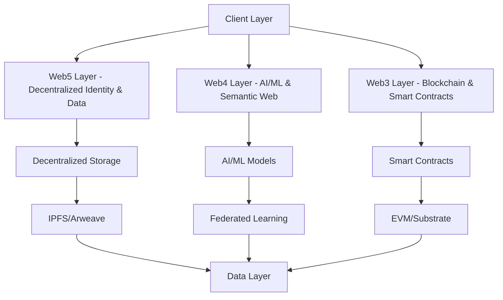

# AIPlatform Web3/4/5 Architecture

## Overview

This document outlines the multi-layered architecture of AIPlatform, integrating Web3, Web4, and Web5 technologies to create a decentralized, scalable, and user-centric AI platform.

## Architecture Layers

## Component Breakdown

### 1. Web3 Layer (Blockchain Infrastructure)
- **Smart Contracts**: For decentralized governance, tokenomics, and protocol rules
- **Blockchain Network**: EVM-compatible chain or Substrate-based
- **Wallets & Signers**: Integration with popular Web3 wallets
- **Oracles**: For off-chain data verification

### 2. Web4 Layer (AI/ML & Semantic Web)
- **Federated Learning**: Decentralized model training
- **Knowledge Graphs**: For semantic understanding
- **AI Agents**: Autonomous agents for platform operations
- **Data Marketplaces**: For training data exchange

### 3. Web5 Layer (Decentralized Identity & Data)
- **DID (Decentralized Identifiers)**: Self-sovereign identity
- **VC (Verifiable Credentials)**: For reputation and credentials
- **DWN (Decentralized Web Nodes)**: Personal data storage
- **DAGs**: For data structure and verification

## Data Flow

1. **User Authentication**: Web5 DIDs for identity
2. **Data Storage**: Encrypted storage via IPFS/Arweave
3. **Computation**: Federated learning for AI/ML
4. **Governance**: On-chain voting and proposals
5. **Monetization**: Token-based economy

## Security Considerations
- End-to-end encryption
- Zero-knowledge proofs for privacy
- Multi-signature wallets
- Decentralized access control

## Vertical Architecture

### Domain-Specific Verticals
- **AI Training Vertical**: Federated learning, model deployment, performance monitoring
- **Blockchain Governance Vertical**: DAOs, voting mechanisms, treasury management
- **Data Marketplace Vertical**: Dataset trading, model licensing, validation
- **User Identity Vertical**: DID management, verifiable credentials, Web5 integration
- **Backlog Management Vertical**: Project tracking, task assignment, Git integration

### Implementation
Each vertical is a self-contained module with dedicated controllers, models, and APIs.

## Horizontal Services

### Cross-Cutting Services
- **Logging Horizontal**: Centralized logging, structured data, real-time streaming
- **Caching Horizontal**: Redis-based caching, invalidation strategies, performance optimization
- **Authentication Horizontal**: Multi-provider auth, JWT tokens, role-based access
- **Monitoring Horizontal**: Metrics collection, error tracking, health checks, alerting

### Implementation
Horizontals provide shared functionality that can be injected into any vertical.

## Bridge Systems

### Blockchain Bridges
- **Polkadot**: Cross-chain interoperability with parachains
- **Ethereum**: Smart contracts and DeFi integration
- **Solana**: High-performance DApp connections
- **BSC**: DeFi and token bridge
- **Cardano**: Advanced smart contract bridge
- **Avalanche**: High-throughput transaction bridge

### AI Bridges
- **OpenAI GPT**: Chat and text generation
- **Claude**: Advanced reasoning and analysis
- **Llama**: Open-source AI model integration
- **GenAI**: Media generation capabilities
- **MCP**: Model context sharing protocol
- **Custom AI**: Extensible AI system integration

### API Bridges
- **Code + Vibe Transfer**: Share code with contextual metadata
- **REST/GraphQL**: Standard API integrations
- **Custom Protocols**: Enterprise-specific bridges

### Bridge Interface
All bridges implement a standardized interface for seamless integration across platforms.

## Deployment Architecture

### Multi-Platform Deployment
- **Desktop**: Electron apps for Windows, macOS, Linux
- **Mobile**: React Native for iOS/Android, Capacitor for hybrid
- **Web**: PWA with Web3/4/5 support
- **Specialized**: WinUWP, Aurora, Tizen, HarmonyOS, tvOS

### Infrastructure
- **Containerization**: Docker for consistent deployments
- **Orchestration**: Kubernetes for scaling
- **Edge Computing**: Global CDN for low-latency access
- **CI/CD**: Automated pipelines for all platforms
