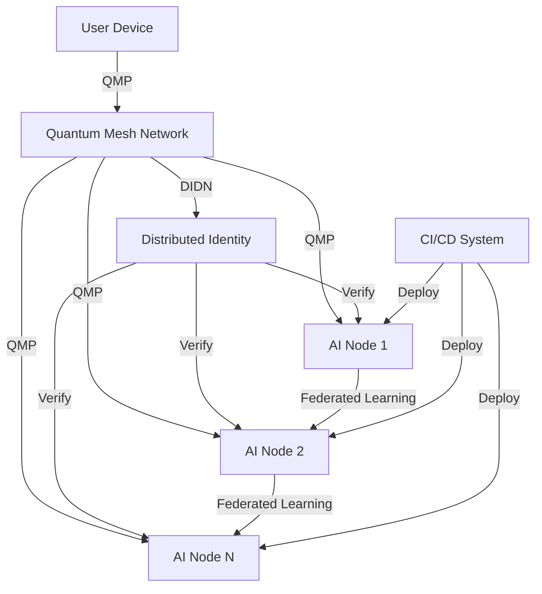

# 🌌 Quantum Infrastructure Zero - Developer Guide

## 🚀 Introduction

Welcome to Quantum Infrastructure Zero, a revolutionary approach to decentralized networking that eliminates traditional servers, DNS, and centralized infrastructure. This guide will help you understand and work with the core components of the system.

## 📦 Core Components

### 1. Distributed Identity & Data Network (DIDN)

**Purpose**: Replace DNS and PKI with a decentralized identity and data management system.

```python
from didn import DIDN, Identity

# Initialize a new DIDN instance
didn = DIDN()

# Create a new identity
identity_id = didn.register_identity(
    public_key="user_public_key_here",
    signature="signature_here",
    metadata={"name": "Test User"}
)

# Store and retrieve data
data = {"message": "Hello, Quantum World!"}
data_id = didn.store_data(identity_id, data, "signature_here")
retrieved = didn.resolve_data(data_id)
```

### 2. Quantum Mesh Protocol (QMP)

**Purpose**: Enable decentralized communication without traditional addressing.

```python
import asyncio
from qmp import QMPService, QMPMessage

async def handle_chat(message: QMPMessage, writer):
    print(f"Received message: {message.content}")

async def main():
    # Create and start QMP service
    qmp = QMPService("node1")
    await qmp.start(port=8000)
    
    # Register message handler
    qmp.register_handler("chat", handle_chat)
    
    # Create and send a message
    message = qmp.create_message(
        content={"text": "Hello from Node 1!"},
        message_type="chat"
    )
    
    # In a real app, you would connect to other nodes first
    # await qmp.broadcast(message)

# Run the event loop
asyncio.run(main())
```

### 3. AI Nodes

**Purpose**: Enable federated learning across decentralized nodes.

```python
import numpy as np
from ai_nodes import AINode

# In a real implementation, you would use a proper ML framework
class SimpleModel:
    def get_weights(self):
        return {"weights": np.random.rand(10)}
    
    def set_weights(self, weights):
        pass

# Create an AI node
model = SimpleModel()
node = AINode("node1", model)

# Simulate training
data = {"x": np.random.rand(100, 10), "y": np.random.rand(100, 1)}
update = await node.train(data)
print(f"Trained with {update.samples_count} samples")
```

### 4. Self-Contained CI/CD

**Purpose**: Enable autonomous deployment without centralized servers.

```python
import asyncio
from self_contained_cicd import SelfContainedCICD

async def run_pipeline():
    cicd = SelfContainedCICD(project_root="./my_project")
    
    # Configure pipeline steps
    cicd.config = {
        "build_steps": [
            {"name": "Install Dependencies", "command": "pip install -r requirements.txt"},
            {"name": "Build", "command": "python setup.py build"}
        ],
        "test_steps": [
            {"name": "Run Tests", "command": "pytest tests/"}
        ],
        "deploy_steps": [
            {"name": "Deploy", "script": "deploy.py"}
        ]
    }
    
    # Run the pipeline
    success = await cicd.run_pipeline()
    print(f"Pipeline {'succeeded' if success else 'failed'}")

asyncio.run(run_pipeline())
```

## 🏗️ System Architecture



## 🔍 Example: Building a Decentralized Chat Application

1. **Set up identities**
   ```python
   # Initialize DIDN
   didn = DIDN()
   
   # Each user creates an identity
   alice_id = didn.register_identity(
       public_key="alice_public_key",
       signature="alice_signature",
       metadata={"name": "Alice"}
   )
   
   bob_id = didn.register_identity(
       public_key="bob_public_key",
       signature="bob_signature",
       metadata={"name": "Bob"}
   )
   ```

2. **Create QMP service**
   ```python
   async def handle_chat_message(message: QMPMessage, writer):
       sender = didn.resolve_identity(message.sender_id)
       print(f"{sender.metadata['name']}: {message.content['text']}")
   
   qmp = QMPService("chat_node")
   qmp.register_handler("chat_message", handle_chat_message)
   await qmp.start(port=8000)
   ```

3. **Send messages**
   ```python
   message = qmp.create_message(
       content={"text": "Hello, Bob!"},
       message_type="chat_message"
   )
   await qmp.broadcast(message)
   ```

## 🧪 Testing the System

1. **Unit Tests**
   ```bash
   # Run all tests
   python -m pytest tests/
   
   # Run specific test module
   python -m pytest tests/test_didn.py
   ```

2. **Integration Testing**
   ```bash
   # Start test network
   python tests/start_test_network.py
   
   # Run integration tests
   python -m pytest tests/integration/
   ```

## 🚀 Deployment

### Local Development
```bash
# Install dependencies
pip install -r requirements.txt

# Start a node
python -m quantum_infra_zero.node --port 8000
```

### Production Deployment
```bash
# Using Docker
# Build the image
docker build -t quantum-node .

# Run a node
docker run -d -p 8000:8000 quantum-node

# Or with Docker Compose
docker-compose up -d
```

## 📚 Additional Resources

- [API Reference](./API_REFERENCE.md)
- [Architecture Deep Dive](./ARCHITECTURE.md)
- [Security Guidelines](./SECURITY.md)
- [Contributing Guide](./CONTRIBUTING.md)

## 🤝 Contributing

We welcome contributions! Please see our [Contributing Guide](./CONTRIBUTING.md) for details on how to contribute to the project.

## 📄 License

This project is licensed under the Apache 2.0 License - see the [LICENSE](LICENSE) file for details.
